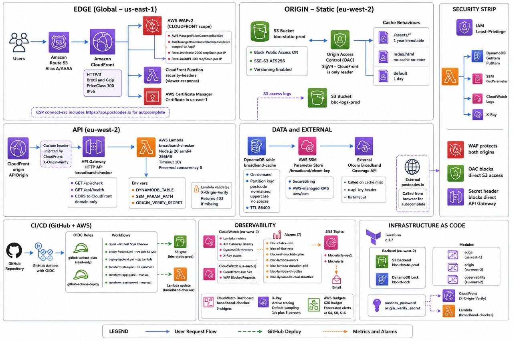
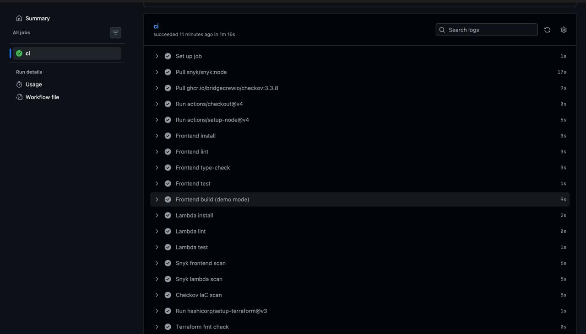
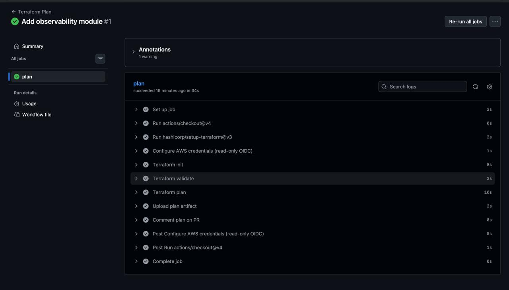
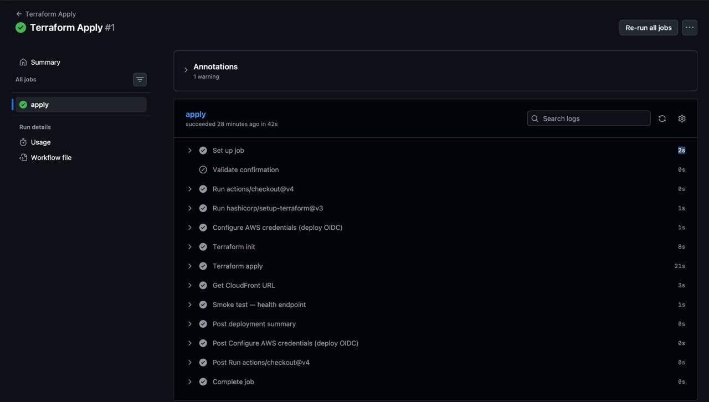
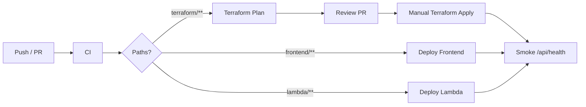

<p align="center">
  
</p>

<h1 align="center">UK Broadband Checker — Serverless on AWS</h1>

<p align="center">
  <strong>Production-grade static app + API</strong> — provisioned entirely with Terraform,<br/>
  secured with CloudFront + WAF + Zero-Trust origin headers, and shipped through GitHub Actions (OIDC — no long-lived AWS keys).
</p>

<p align="center">
  <a href="https://ismaelbroadband.online/"></a>
  <a href="https://ismaelbroadband.online/api/health"></a>
  <a href="https://github.com/ismaelyasindev/Uk_Broadband_Checker_S3_static_app/actions"></a>
</p>

<p align="center">
  
  
  
  
  
  
  
  
  
  
</p>

---

## Why this project

Most “static site on S3” demos stop at a bucket and a CloudFront URL. This one is built like a **real production edge + origin system**:

- Infrastructure is **100% Terraform** (bootstrap → origin → edge → observability)
- Deploys authenticate with **GitHub OIDC** (plan role vs deploy role — least privilege)
- Edge is locked down with **ACM HTTPS, WAF, CSP headers, and an origin-verify secret**
- Backend is **cache-aside DynamoDB + SSM** (Ofcom key never in the browser)
- Post-deploy **smoke tests** hit `/api/health` before the pipeline goes green

> Modelled on Ofcom’s public broadband coverage experience — rebuilt as a secure, automated AWS portfolio system.

<p align="center">
  
  <br/>
  <em>Live lookup on <a href="https://ismaelbroadband.online/">ismaelbroadband.online</a></em>
</p>

---

## Architecture

<p align="center">
  
</p>

```text
Browser
  │  HTTPS (ACM)
  ▼
Route 53 ──► CloudFront (+ WAF + security-headers CloudFront Function)
  │                │
  │ /              │ /api/*
  ▼                ▼
S3 (OAC only)    API Gateway HTTP API
                   │  X-Origin-Verify
                   ▼
                 Lambda (arm64, Node 20, X-Ray)
                   │
        ┌──────────┼──────────┐
        ▼          ▼          ▼
   DynamoDB     SSM Param   Ofcom API
   (cache)     (API key)   (live data)
```

| Layer | What it owns |
|-------|----------------|
| **Bootstrap** | Remote state (S3 + DynamoDB lock), GitHub OIDC provider, plan/deploy IAM roles |
| **Origin** (`eu-west-2`) | S3 static + logs, API Gateway, Lambda, DynamoDB cache, SSM Ofcom key |
| **Edge** (`us-east-1`) | ACM cert, WAF, CloudFront, Route 53 alias, security headers function |
| **Observability** | CloudWatch alarms + dashboard, SNS email alerts, AWS Budget |

---

## Infrastructure highlights

<table>
<tr>
<td width="50%">

### Edge security
- Custom domain + **ACM** certificate (DNS-validated)
- **CloudFront** HTTP/2 + HTTP/3, OAC to private S3
- **WAF**: managed rule groups + rate limits
- **CSP / HSTS / XFO** via CloudFront Function
- `X-Origin-Verify` secret on every `/api/*` origin request

</td>
<td width="50%">

### Origin design
- Lambda **arm64** + active **X-Ray** tracing
- **DynamoDB** cache-aside (TTL) — no postcodes in logs (`pc_hash` only)
- Ofcom key in **SSM SecureString**, memoized on warm invokes
- API routes: `/api/check`, `/api/health`
- Structured JSON logs → CloudWatch (14-day retention)

</td>
</tr>
<tr>
<td width="50%">

### Delivery & caching
- Two-pass S3 sync: hashed assets = **immutable 1y cache**
- `index.html` = **no-cache** (instant deploys)
- CloudFront cache policy whitelists `pc` for API
- Logging v2 → hardened logs bucket

</td>
<td width="50%">

### Observability & cost
- Dashboard: CF / WAF / Lambda / DDB / API / alarms
- Alarms split by region (CF+WAF in **us-east-1**)
- SNS email alerts (dual-region topics)
- **$20** monthly budget with forecast thresholds

</td>
</tr>
</table>

---

## CI/CD — six workflows, zero long-lived AWS keys

Authentication is **OIDC only**. Secrets store role ARNs and app keys — never AWS access keys.

| Workflow | Trigger | Role | Purpose |
|----------|---------|------|---------|
| `ci.yml` | Push / PR | — | Lint, test, build, **Snyk**, **Checkov**, `terraform fmt` |
| `terraform-plan.yml` | PR (`terraform/**`) | Plan (read-only) | `init` → `validate` → `plan` → PR comment |
| `terraform-apply.yml` | Manual (`apply-prod`) | Deploy | Apply + CloudFront URL + **health smoke test** |
| `deploy-frontend.yml` | Push `frontend/**` | Deploy | Vite build (`VITE_API_URL=/api`) + two-pass S3 sync |
| `deploy-backend.yml` | Push `lambda/**` | Deploy | Zip `lambda/src` → update function + smoke test |
| `terraform-destroy.yml` | Manual (`destroy-prod`) | Deploy | Teardown (state bucket retained) |

GitHub Environments: **`production`** (deploys / apply) and **`production-destroy`** (destroy gating).

### Pipeline proof

<p align="center"><strong>CI — lint, tests, Snyk, Checkov, Terraform fmt</strong></p>
<p align="center">
  
</p>

<p align="center"><strong>Terraform Plan — OIDC read-only role on PR</strong></p>
<p align="center">
  
</p>

<p align="center"><strong>Terraform Apply — deploy role + smoke test</strong></p>
<p align="center">
  
</p>



---

## Repository layout

```text
├── .github/workflows/          # CI, deploys, Terraform plan/apply/destroy
├── cloudfront-functions/       # CSP + security headers (viewer-response)
├── frontend/                   # React + Vite + TS (demo or live API)
├── lambda/                     # Node 20 handler + Vitest (100% coverage)
├── terraform/
│   ├── bootstrap/              # State bucket, lock table, OIDC roles
│   ├── main/                   # Root stack (origin + edge + observability)
│   └── modules/
│       ├── origin/             # eu-west-2 compute & storage
│       ├── edge/               # us-east-1 CDN / WAF / DNS / ACM
│       └── observability/      # Alarms, dashboard, budget, SNS
└── docs/                       # Design specs + README assets
```

---

## Deploy model

### First-time infrastructure (local bootstrap → CI thereafter)

```bash
# 1) Bootstrap remote state + OIDC (once)
cd terraform/bootstrap
terraform init && terraform apply

# 2) Main stack
cd ../main
terraform init
terraform apply -var="ofcom_api_key=<OFCOM_KEY>"
```

After that, infra changes flow through **PR plan → merge → manual apply**.

### Frontend / Lambda (automated)

```text
main push (frontend/**)  →  build VITE_API_URL=/api  →  S3 two-pass sync
main push (lambda/**)    →  zip lambda/src           →  update-function-code → smoke test
```

### Safety rails

- Typed confirmation strings: `apply-prod` / `destroy-prod`
- Environment approvals on production paths
- Deploy preflight fails fast if S3 / Lambda do not exist yet
- State bucket + lock table use `prevent_destroy`

---

## Security model (short version)

| Control | Implementation |
|---------|----------------|
| No public S3 website | CloudFront **OAC** only |
| No long-lived AWS keys in CI | **GitHub OIDC** assume-role |
| API not directly callable | Origin header secret from CloudFront |
| Secrets out of git / browser | SSM SecureString + GitHub Secrets |
| Edge hardening | WAF + HSTS + CSP + frame deny |
| GDPR-conscious logs | Postcode never logged — SHA-256 `pc_hash` only |

---

## Run locally (no AWS required)

Demo mode is the recruiter / teardown story — full UI without cloud spend:

```bash
cd frontend
npm install
npm run dev          # VITE_API_URL=/demo by default
```

```bash
cd lambda
npm install
npm test             # fully mocked — 100% coverage gate
```

---

## Cost posture

Designed to stay near **free-tier / low dollars**:

- CloudFront PriceClass_100, S3 + DynamoDB on-demand
- CloudWatch standard metrics + ≤10 alarms + 1 dashboard
- Single **$20** budget with forecast alerts at 20% / 40% / 80%
- Destroy workflow available when the live demo window ends — **code + demo mode remain**

---

## Live verification

```bash
curl -s https://ismaelbroadband.online/api/health
# {"status":"ok","ts":"..."}
```

| Check | Expected |
|-------|----------|
| https://ismaelbroadband.online | App loads over HTTPS (ACM) |
| Postcode lookup | Results + map pin |
| Repeat lookup | Faster path via DynamoDB cache |
| GitHub Actions | CI / Plan / Apply / Deploy green |

---

## Author

**Ismael Yasin** — DevOps & Cloud Engineer  
Portfolio: [ismaelyasin.site](https://www.ismaelyasin.site) · GitHub: [ismaelyasindev](https://github.com/ismaelyasindev)

---

<p align="center">
  <sub>Built for production habits — Terraform, OIDC, edge security, and pipelines you can screenshot.</sub>
</p>
